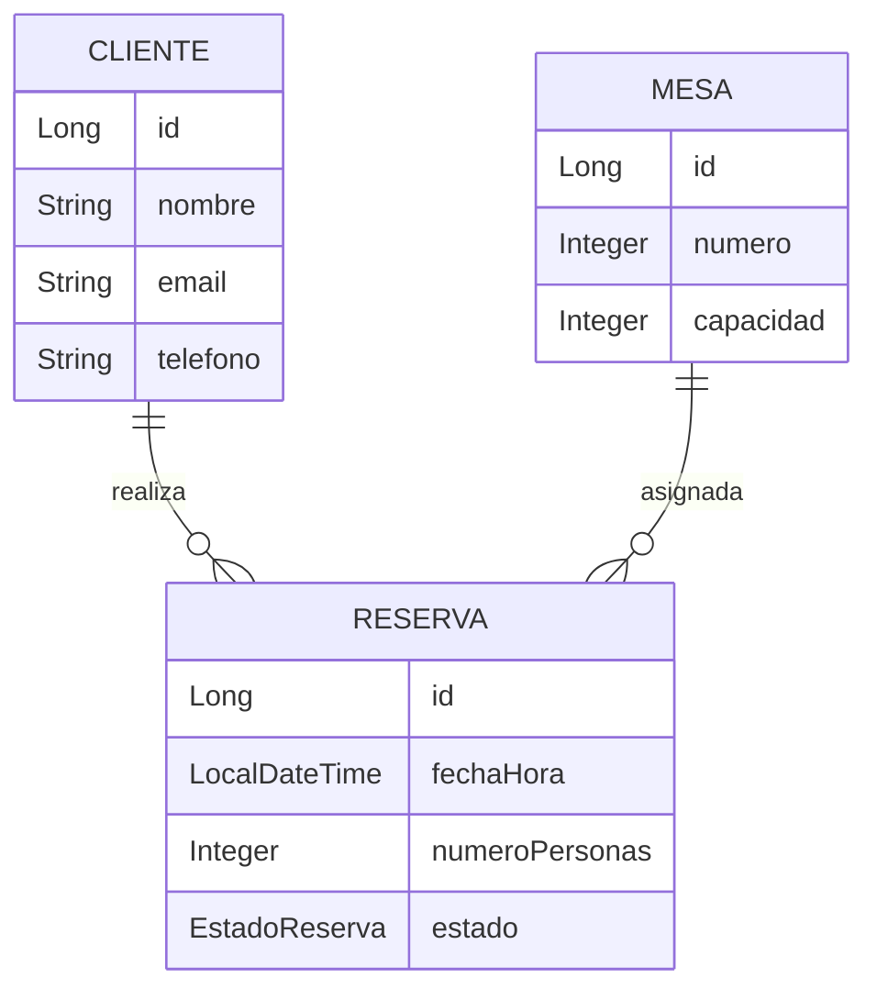

# Restaurant Reservation System API

> Backend RESTful desarrollado con **Java 21** y **Spring Boot** para la gestión de reservas de restaurante.  
> El sistema permite gestionar clientes, mesas y reservas aplicando validaciones de disponibilidad, capacidad y control de estados en tiempo real siguiendo una arquitectura en capas.

[Java](https://www.oracle.com/java/)
[Spring Boot](https://spring.io/projects/spring-boot)
[PostgreSQL](https://www.postgresql.org/)
[Maven](https://maven.apache.org/)
[License](LICENSE)

---

# 📋 Tabla de contenidos

- [Descripción](#-descripción)
- [Características técnicas](#-características-técnicas)
- [Tecnologías](#️-tecnologías)
- [Arquitectura](#️-arquitectura)
- [Estructura del proyecto](#-estructura-del-proyecto)
- [Requisitos previos](#-requisitos-previos)
- [Instalación y configuración](#-instalación-y-configuración)
- [Ejecución](#️-ejecución)
- [Endpoints](#-endpoints)
- [Ejemplos de uso](#-ejemplos-de-uso)
- [Modelo de datos](#️-modelo-de-datos)
- [Manejo de errores](#️-manejo-de-errores)
- [Documentación interactiva](##-documentación-interactiva)
- [Roadmap](#-roadmap)
- [Autor](#-autor)
- [Licencia](#-licencia)

---

# 📖 Descripción

Restaurant Reservation System API es una aplicación backend desarrollada con Spring Boot que permite administrar reservas de restaurante mediante una API RESTful.

El sistema implementa reglas de negocio para validar:

- disponibilidad de mesas,
- capacidad máxima por reserva,
- control de estados,
- y conservación del historial mediante soft delete.

Está diseñado siguiendo buenas prácticas de desarrollo backend, aplicando separación de responsabilidades mediante arquitectura en capas.

---

# Características técnicas

- Arquitectura en capas
- API RESTful
- Persistencia con Spring Data JPA
- Base de datos PostgreSQL
- Validación de datos con Bean Validation
- Relaciones JPA entre entidades
- Gestión de estados de reserva
- Soft delete para conservar historial
- Consultas de disponibilidad en tiempo real
- Configuración externalizada mediante `application.properties`
- Código limpio utilizando Lombok
- Proyecto preparado para escalabilidad y mantenimiento

---

# 🛠️ Tecnologías

| Tecnología | Uso |
|------------|-----|
| Java 21 | Lenguaje principal |
| Spring Boot 3.x | Framework backend |
| Spring Data JPA | Persistencia y acceso a datos |
| Spring Validation | Validación de datos |
| PostgreSQL | Base de datos relacional |
| Lombok | Reducción de boilerplate |
| Maven | Gestión de dependencias |

---

# Arquitectura

El proyecto implementa una **arquitectura en capas**, separando responsabilidades para mejorar el mantenimiento, la escalabilidad y el testeo.

```text
Controller Layer
        │
        ▼
Service Layer
        │
        ▼
Repository Layer
        │
        ▼
PostgreSQL
```

### Flujo de una petición

```text
Cliente HTTP
    │
    ▼
Controller
    │
    ▼
Service
    │
    ▼
Repository
    │
    ▼
Database
```

### Beneficios de esta arquitectura

- Separación clara de responsabilidades
- Mayor mantenibilidad
- Escalabilidad del sistema
- Reutilización de lógica de negocio
- Facilidad para testing y evolución del proyecto

---

# Estructura del proyecto

```text
src/main/java/com/dscb/reservas_restaurante/
│
├── controller/         # Endpoints REST
│   ├── MesaController.java
│   └── ReservaController.java
│
├── service/            # Lógica de negocio
│   ├── MesaService.java
│   └── ReservaService.java
│
├── repository/         # Acceso a datos
│   ├── ClienteRepository.java
│   ├── MesaRepository.java
│   └── ReservaRepository.java
│
├── model/              # Entidades JPA
│   ├── Cliente.java
│   ├── Mesa.java
│   ├── Reserva.java
│   └── EstadoReserva.java
│
└── ReservasRestauranteApplication.java
```

---

# ✅ Requisitos previos

Asegúrate de tener instalado:

- Java 21
- PostgreSQL 16+
- Maven 3.9+ *(opcional si utilizas Maven Wrapper)*

---

# Instalación y configuración

## 1. Clonar el repositorio

```bash
git clone https://github.com/sebascedano99/reservas-restaurante.git
cd reservas-restaurante
```

---

## 2. Crear la base de datos

Conéctate a PostgreSQL y ejecuta:

```sql
CREATE DATABASE restaurante;
```

---

## 3. Configurar variables de entorno

Copia el archivo de ejemplo:

```bash
cp src/main/resources/application.properties.example src/main/resources/application.properties
```

Edita el archivo `application.properties`:

```properties
spring.datasource.url=jdbc:postgresql://localhost:5432/restaurante
spring.datasource.username=TU_USUARIO
spring.datasource.password=TU_PASSWORD

spring.jpa.hibernate.ddl-auto=update
spring.jpa.show-sql=true
spring.jpa.properties.hibernate.format_sql=true
```

---

## 4. Instalar dependencias

```bash
mvn clean install
```

---

## 5. Insertar datos de prueba

```sql
INSERT INTO clientes (nombre, email, telefono)
VALUES ('Pepe Perez', 'pepeperez@gmail.com', '603XXXXXX');

INSERT INTO mesas (numero, capacidad)
VALUES
(1, 2),
(2, 4),
(3, 6),
(4, 8);
```

---

# Ejecución

## Ejecutar en desarrollo

```bash
./mvnw spring-boot:run
```

---

# Endpoints

## Reservas — `/reservas`

| Método | Endpoint | Descripción |
|--------|----------|-------------|
| `POST` | `/reservas` | Crear una reserva |
| `GET` | `/reservas/{id}` | Obtener una reserva por ID |
| `GET` | `/reservas?clienteId={id}` | Obtener reservas de un cliente |
| `PUT` | `/reservas/{id}` | Actualizar una reserva |
| `DELETE` | `/reservas/{id}` | Cancelar una reserva |

---

## Mesas — `/mesas`

| Método | Endpoint | Descripción |
|--------|----------|-------------|
| `GET` | `/mesas/disponibles?fechaHora={fecha}&numeroPersonas={n}` | Consultar mesas disponibles |

---

# Ejemplos de uso

## Crear una reserva

```http
POST /reservas
Content-Type: application/json

{
    "cliente": {
        "id": 1
    },
    "mesa": {
        "id": 1
    },
    "fechaHora": "2026-04-20T20:30:00",
    "numeroPersonas": 2
}
```

### Respuesta `201 Created`

```json
{
    "id": 1,
    "cliente": {
        "id": 1,
        "nombre": "Sebastian Cedano"
    },
    "mesa": {
        "id": 1,
        "numero": 1,
        "capacidad": 4
    },
    "fechaHora": "2026-04-20T20:30:00",
    "numeroPersonas": 2,
    "estado": "PENDIENTE"
}
```

---

## Consultar mesas disponibles

```http
GET /mesas/disponibles?fechaHora=2026-04-20T20:30:00&numeroPersonas=2
```

---

## Actualizar una reserva

```http
PUT /reservas/1
Content-Type: application/json

{
    "fechaHora": "2026-04-21T21:00:00",
    "numeroPersonas": 3,
    "estado": "CONFIRMADA"
}
```

---

## Cancelar una reserva

```http
DELETE /reservas/1
```

---

# 🗄️ Modelo de datos



---

## Estados de reserva

```text
PENDIENTE ──→ CONFIRMADA
    │
    ▼
CANCELADA
```

---

## Manejo de errores

La API devuelve respuestas de error con una estructura estándar en todos los endpoints:

```json
{
    "status": 404,
    "mensaje": "Reserva no encontrada",
    "timestamp": "2026-05-22T20:30:00"
}
```

### Códigos de respuesta HTTP

| Código | Tipo | Cuándo ocurre |
|--------|------|---------------|
| `200` | OK | Petición procesada correctamente |
| `201` | Created | Recurso creado correctamente |
| `400` | Bad Request | Mesa no disponible o número de personas excede la capacidad |
| `404` | Not Found | Cliente, mesa o reserva no encontrada |
| `500` | Internal Server Error | Error inesperado del servidor |

### Ejemplos de error

**Recurso no encontrado `404`:**
```json
{
    "status": 404,
    "mensaje": "Reserva no encontrada",
    "timestamp": "2026-05-22T20:30:00"
}
```

**Regla de negocio violada `400`:**
```json
{
    "status": 400,
    "mensaje": "Mesa no disponible",
    "timestamp": "2026-05-22T20:30:00"
}
```
---

##  Documentación interactiva

La API incluye documentación interactiva generada automáticamente con **Swagger UI / OpenAPI 3.1**.

Una vez arrancada la aplicación, accede a:
http://localhost:8080/swagger-ui/index.html

Desde esta interfaz puedes:
-  Ver todos los endpoints disponibles organizados por controller
-  Probar cualquier endpoint directamente desde el navegador sin necesidad de Postman
-  Ver la estructura exacta de los objetos JSON que acepta y devuelve cada endpoint
-  Consultar el esquema OpenAPI en formato JSON en `http://localhost:8080/v3/api-docs`

### Vista previa

| Sección | Descripción |
|---------|-------------|
| `reserva-controller` | Endpoints de gestión de reservas |
| `mesa-controller` | Endpoints de consulta de mesas |

---

# 🚧 Roadmap

- [ ] Implementar autenticación JWT
- [ ] Añadir roles de usuario
- [ ] Dockerizar la aplicación
- [ ] Añadir tests unitarios e integración
- [ ] Integrar CI/CD con GitHub Actions
- [ ] Añadir documentación Swagger/OpenAPI completa
- [ ] Implementar paginación y filtros

---

# 👤 Autor

**Sebastián Cedano Barbosa**

- GitHub: https://github.com/sebascedano99
- LinkedIn: https://linkedin.com/in/david-sebastian-cedano-barbosa-2b61a7254

---

# 📄 Licencia

Este proyecto está bajo la licencia MIT.

Consulta el archivo `LICENSE` para más información.

